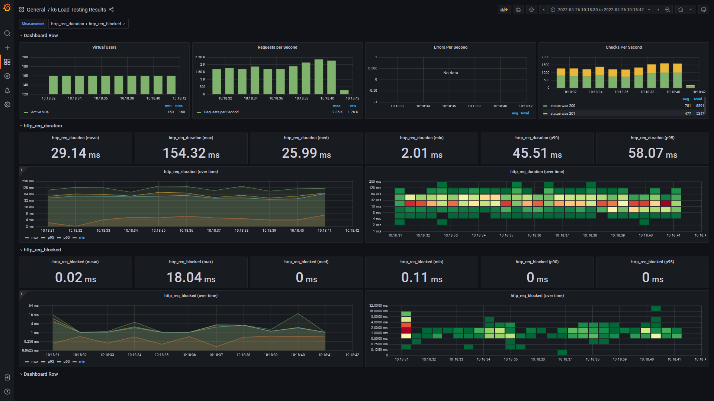

# Voting REST service test task

[](https://github.com/andrei-punko/voting-service/actions/workflows/maven.yml)
[](https://github.com/andrei-punko/voting-service/actions/workflows/maven.yml)

## Prerequisites
- Maven 3
- JDK 17
- K6 (install according to [manual](https://k6.io/docs/getting-started/installation))

## Implement Voting REST service with next operations
- Get candidates (should be read from json file)
- Make vote (by passport id) (no double vote allowed)
- Get voting results


## How to build
    mvn clean install

## How to start
- Use `run.bat` script in project root folder or
- Use Docker compose:  
  `docker-compose up`

## Swagger documentation page
http://localhost:8090/swagger-ui.html

## Useful CURL commands
- Get candidates
```bash
curl http://localhost:8090/candidates
```

- Get voting results
```bash
curl http://localhost:8090/votings
```

- Make vote
```bash
curl -X POST http://localhost:8090/votings/3434 \
  -H "Content-Type: application/json" \
  -d "{ \"name\": \"Andrei\", \"passportId\": \"MP345353634543\"}"
```

## How to run Spock-based functional tests
```bash
cd func-tests
./gradlew clean build
```

Check tests report at `./func-tests/build/spock-reports/index.html`

## How to run k6-based performance tests (console output)

```bash
cd load-tests
k6 run script.js
```

## How to run k6-based performance tests (with Grafana visualization)

* Start InfluxDB and Grafana (according to https://k6.io/blog/k6-loves-grafana/)
```
git clone https://github.com/grafana/k6 && cd k6
git submodule update --init
docker-compose up -d influxdb grafana
```
Grafana available via http://localhost:3000

Add datasource with next params:
<pre>
URL: http://localhost:8086
Access: Browser
Database: mydb
HTTP Method: GET
</pre>

* Run load test with sending data to Grafana
```
k6 run -o influxdb=http://localhost:8086/mydb script.js
```

* Import dashboard to Grafana from file `./load-tests/k6-grafana-dashboard.json` and get results  


